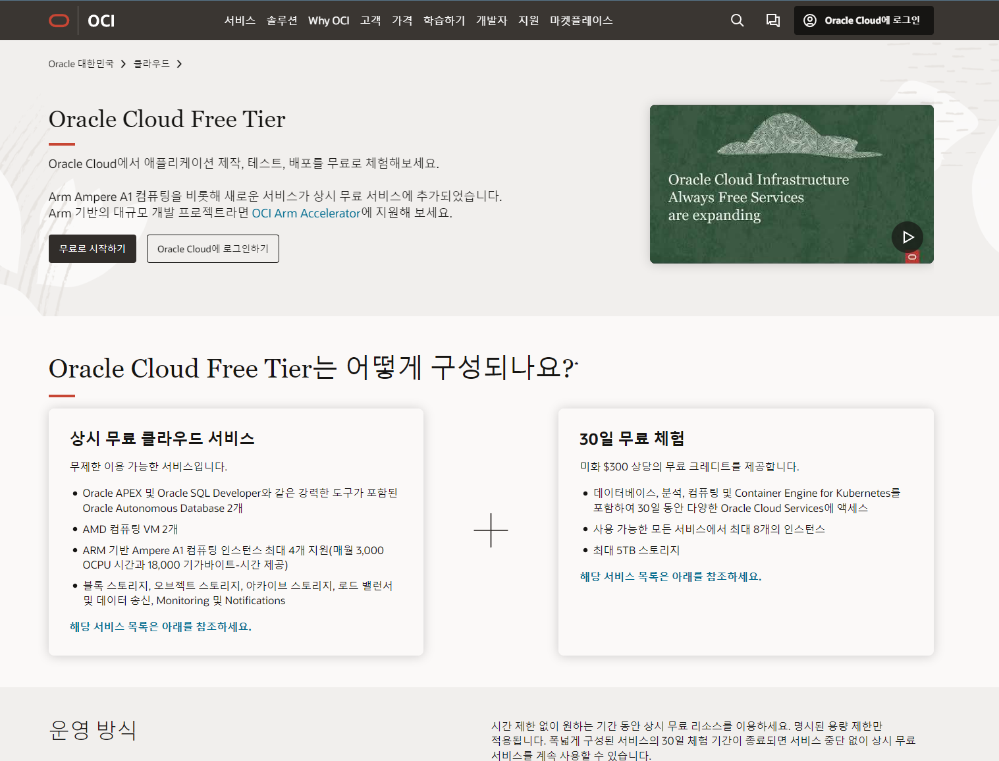

# 🗞 가이드 안내

## 목차

* 클라우드 서비스 오라클(Oracle) 가입
* 국내도메인 서비스 가비아 안내

## 오라클

[1977년](https://namu.wiki/w/1977%EB%85%84) [래리 엘리슨](https://namu.wiki/w/%EB%9E%98%EB%A6%AC%20%EC%97%98%EB%A6%AC%EC%8A%A8)이 설립한 [미국](https://namu.wiki/w/%EB%AF%B8%EA%B5%AD)의 대표적인 소프트웨어 회사

### 오라클 서비스 설명

해당하는 오라클 기업에서는 평생무료로 컴퓨팅 서비스를 제공 받을 수 있는 혜택을 제공합니다.

> 타 클라우드 회사와 달리 [Google Cloud Platform](https://namu.wiki/w/Google%20Cloud%20Platform)와 비슷하게 [프리 티어](https://www.oracle.com/kr/cloud/free/)로 평생 무료 VM 인스턴스를 제공하는데 구성이 매우 파격적이며 공격적인 마케팅으로 사업을 하고 있다.
>
> 출처 : 나무위키 (오라클 - 클라우드 OCI 내용중)

### 오라클 가입

g 오라클 클라우드 가입 \[링크이동]\([https://www.oracle.com/kr/cloud/](https://www.oracle.com/kr/cloud/))

***

1.  무료로 시작하기 버튼 클릭

    <figure><figcaption></figcaption></figure>

2.  계정정보를 입력합니다.

    <figure><figcaption></figcaption></figure>

3.  홈 영역은 춘천 으로 설정합니다. 서울은 장애가 발생 할 수 있습니다.

    <figure><figcaption></figcaption></figure>
4.  신용카드 정보를 기입하여 페이서비스 등록 검증을 완료합니다. 이 과정은 돈이 지불되지  않습니다.

    <figure><figcaption></figcaption></figure>

## 가비아

### 가비아 서비스가입

\[가비아회원가입 링크 이동]\([https://www.gabia.com/member/member\_register.php](https://www.gabia.com/member/member\_register.php))

1.  가비아 회원가입&#x20;

    <figure><figcaption></figcaption></figure>

### 도메인 구매

1.  대문 페이지에서 원하는 도메인을 구매합니다.

    <figure><figcaption></figcaption></figure>
